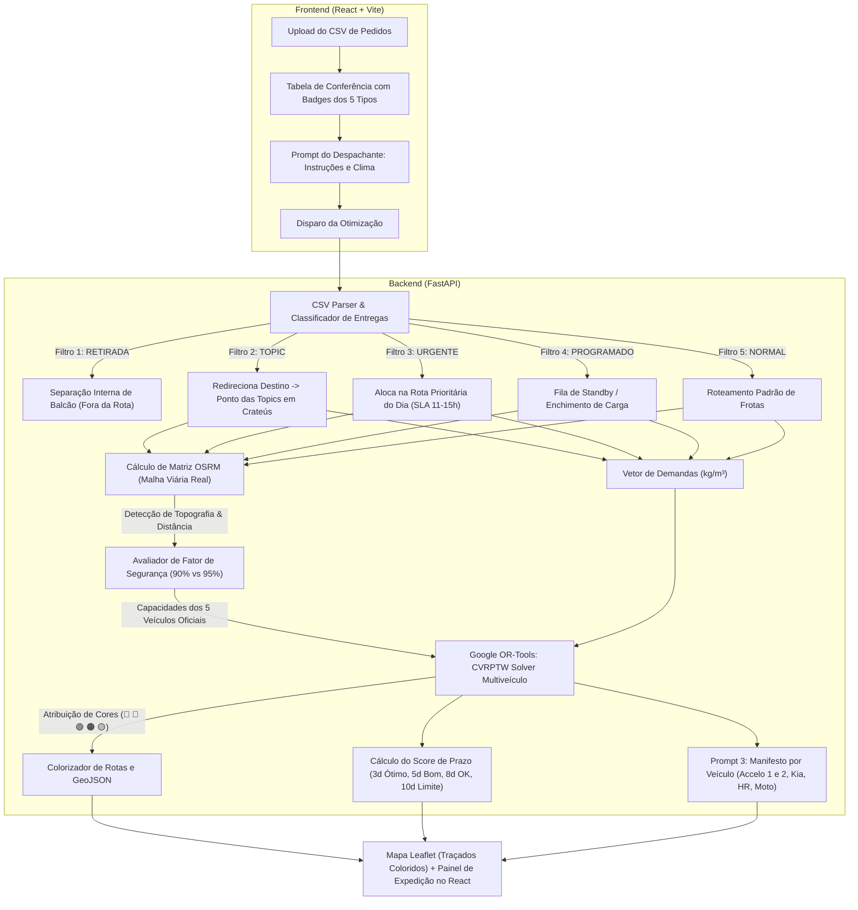

# 🗺️ Plano de Implementação: Otimização Dinâmica de Rotas via Upload de CSVs (Google OR-Tools & Engenharia de Prompt)

Este documento define a arquitetura e o plano de implementação do sistema de roteirização logística, calibrado com a **matriz oficial dos 5 tipos de entrega**, **política de SLAs (prazos para Crateús e Interiores)**, **análise de custo mínimo de frete**, **regra de margem de segurança de carga (90% serra vs 95% plano)** e a **frota oficial da empresa identificada por nomes, cores e emojis**:
- 🔵 **Azul:** **Accelo Grande 1**
- 🔴 **Vermelho:** **Accelo Grande 2**
- 🟢 **Verde:** **Kia Pequeno**
- 🟠 **Laranja:** **HR Pequeno**
- 🟡 **Amarelo:** **Moto** (com capacidade realista de baú reduzida para $50\text{ kg}$)

---

## 1. 📦 Matriz Oficial dos 5 Tipos de Entrega

O sistema classifica e trata cada linha da planilha CSV enviada de acordo com as seguintes regras de negócio estritas:

| Tipo de Entrega | Descrição e Regra de Negócio | Destino Geográfico no Mapa | Tratamento no Google OR-Tools |
| :--- | :--- | :--- | :--- |
| **`RETIRADA`** | O próprio cliente retira na loja/balcão. **Não necessita de frete ou caminhão.** | Nenhum (excluído da rota de veículos). | **Filtrado no pré-processamento.** Não entra no grafo de roteirização. É enviado diretamente para a lista de separação do estoque da loja. |
| **`URGENTE`** | Atendimento prioritário no mesmo dia ou o mais rápido possível. Aplica-se a **clientes fiéis/recorrentes** ou **primeira compra com grande volume/valor**. | Endereço do cliente (Crateús ou Interior). | **Inclusão mandatória na 1ª rota** ou penalidade extrema de descarte (`penalidade = 1.000.000`). Se for Crateús, janela de tempo restrita (11h–15h). |
| **`NORMAL`** | Entrega padrão convencional. Agrupada nas rotas regulares semanais. | Endereço do cliente. | Otimização padrão de custo/distância com base nas capacidades efetivas de peso ($kg$) e volume ($m^3$). |
| **`TOPIC`** *(ou Topique / Carro Horário)* | Mercadoria despachada via transporte intermunicipal/vans de passageiros. **O caminhão não vai até o interior.** | **Ponto das Topics (Terminal Rodoviário de Crateús)**. | O destino é fixado nas coordenadas do **Ponto de Embarque das Topics em Crateús**, com janela de tempo rígida (horário de partida das vans, ex: até as 10:00h). |
| **`PROGRAMADO`** | Entrega sem data fixa imediata (**Standby**). Aguarda consolidação de carga para a região ou sinalização do cliente. | Endereço do cliente no interior. | **Nó opcional com disjunção.** Só entra na rota se houver sobra de espaço no caminhão e a rota passar perto da localidade sem desvio custoso. |

---

## 2. ⏱️ Prazos (SLAs), Custo Mínimo, Margens de Carga e Frota Oficial

### A. Entregas Locais — Dentro da Cidade (Crateús Urbano)
- **Janela de Atendimento:** Máximo de **11 a 15 horas** (mesmo dia / intradiário).
- **Veículos Ideais:** `Moto` (até $50\text{ kg}$) para pequenas urgências ou `HR Pequeno` / `Kia Pequeno` (até $1.700\text{ kg}$) para cargas médias.

### B. Entregas Fora da Cidade — Interiores e Municípios Vizinhos
*(Ipaporanga, Poranga, Ararendá, Novo Oriente, Independência, Tamboril, Nova Russas, Buriti dos Montes, etc.)*
- **Prazo Limite Absoluto:** **10 dias** (não pode ultrapassar sob hipótese alguma).
- **Escala de Avaliação de Eficiência (Score Logístico):**
  - ⭐⭐⭐ **Ótimo:** até **3 dias**
  - ⭐⭐ **Bom:** até **5 dias**
  - ⭐ **OK:** até **8 dias**
  - ⚠️ **Limite Máximo:** até **10 dias**

### C. Custo Mínimo e Viabilidade Econômica (Consolidação de Carga)
Para viagens rurais/interiores:
- Os caminhões pesados (**Accelo Grande 1 e 2**) só devem ser despachados para uma rota de interior se atingirem uma **taxa de ocupação mínima** ($\ge 60\%$ da capacidade) OU se a soma do valor dos pedidos cobrir o custo de combustível do trecho.
- Pedidos com status **`PROGRAMADO`** são utilizados estrategicamente para completar essa ocupação mínima. Se o pedido mais antigo na região atingir $\ge 8$ dias, o despacho torna-se obrigatório para cumprir o SLA máximo de 10 dias.

### D. ⚠️ Regra de Segurança de Carga: 90% (Serras / Longa Distância) vs 95% (Plano / Urbano)
- **Serras, Trechos Rurais e Longas Distâncias:** *Buriti dos Montes, Poranga, Ipaporanga, Monte Nebo, Ibiapaba* $\rightarrow$ **Máximo de 90%** da capacidade do veículo por segurança mecânica, frenagem e subidas acidentadas.
- **Rotas Urbanas, Planas e Proximidades:** *Crateús Urbano e distritos planos vizinhos* $\rightarrow$ **Até 95%** da capacidade do veículo.

### E. 🚛 Frota Oficial da Empresa: Veículos, Cores, Emojis e Capacidades Reais

A frota da empresa é composta por **5 veículos oficiais**, cada um com nome e cor atribuídos para visualização nas rotas do mapa e relatórios:

| Emoji | Cor | Código Hex | Nome do Veículo | Perfil de Operação | Capacidade Nominal | Limite Serra (**90%**) | Limite Urbano (**95%**) |
| :---: | :---: | :---: | :--- | :--- | :---: | :---: | :---: |
| 🔵 | **Azul** | `#2563EB` | **Accelo Grande 1** | Pesado / Rotas de Interior (Eixo Oeste/Sul) | $4.800\text{ kg} \mid 2,45\text{ m}^3$ | **$4.320\text{ kg} \mid 2,20\text{ m}^3$** | **$4.560\text{ kg} \mid 2,33\text{ m}^3$** |
| 🔴 | **Vermelho** | `#DC2626` | **Accelo Grande 2** | Pesado / Rotas de Interior (Eixo Leste/Serra) | $4.800\text{ kg} \mid 2,45\text{ m}^3$ | **$4.320\text{ kg} \mid 2,20\text{ m}^3$** | **$4.560\text{ kg} \mid 2,33\text{ m}^3$** |
| 🟢 | **Verde** | `#16A34A` | **Kia Pequeno** | Médio / Entregas Médias e Interiores Próximos | $1.700\text{ kg} \mid 2,18\text{ m}^3$ | **$1.530\text{ kg} \mid 1,96\text{ m}^3$** | **$1.615\text{ kg} \mid 2,07\text{ m}^3$** |
| 🟠 | **Laranja** | `#EA580C` | **HR Pequeno** | Médio / Urgências e Cargas Médias Urbanas | $1.700\text{ kg} \mid 2,18\text{ m}^3$ | **$1.530\text{ kg} \mid 1,96\text{ m}^3$** | **$1.615\text{ kg} \mid 2,07\text{ m}^3$** |
| 🟡 | **Amarelo** | `#EAB308` | **Moto** | Expresso / Ponto das Topics & Urgências Pequenas | **$50\text{ kg} \mid 0,08\text{ m}^3$** | *(Não vai para serra)* | **$47,5\text{ kg} \mid 0,076\text{ m}^3$** |

> 📌 **Ajuste da Moto:** Capacidade reduzida para **$50\text{ kg}$ e $0,08\text{ m}^3$** (tamanho real de baú de moto/mochila reforçada). Destinada a itens pequenos (ferramentas, torneiras, parafusos, conexões de PVC, fechaduras, números de inox) para atendimento expresso na cidade ou despacho rápido no Ponto das Topics.

---

## 3. 🏛️ Arquitetura do Sistema Atualizada



---

## 4. 🧠 Engenharia de Prompt com a Frota Oficial

### Prompt 1: Extrator Semântico e Alocação dos Veículos
- **Técnica:** *Few-Shot Prompting* com os nomes e capacidades exatas dos 5 veículos.

```markdown
Você é o Especialista em Logística da Distribuidora em Crateús-CE.
Configure os parâmetros para o solucionador Google OR-Tools considerando a frota oficial da empresa:

### Frota Oficial da Empresa:
- 🔵 Azul (#2563EB): Accelo Grande 1 (4.800 kg nominal) - Cargas pesadas de interior
- 🔴 Vermelho (#DC2626): Accelo Grande 2 (4.800 kg nominal) - Cargas pesadas de interior
- 🟢 Verde (#16A34A): Kia Pequeno (1.700 kg nominal) - Médio / Cargas intermediárias
- 🟠 Laranja (#EA580C): HR Pequeno (1.700 kg nominal) - Médio / Urgências urbanas e médias
- 🟡 Amarelo (#EAB308): Moto (50 kg nominal | 0.08 m³) - Cargas pequenas, Ponto das Topics e entregas expressas de Crateús

### Regras de Segurança:
- Se a rota envolver serra ou cidades distantes (Buriti dos Montes, Poranga, Ipaporanga, Monte Nebo): aplicar limite de 90% da capacidade nominal.
- Se a rota for urbana ou plana: aplicar limite de 95% da capacidade nominal.
- Cargas acima de 50 kg NUNCA podem ser atribuídas à Moto.

### Entrada Atual:
Instrução do Despachante: "{{ USER_DISPATCH_PROMPT }}"
Cidades no Lote: {{ CITIES_IN_BATCH }}

Responda com o JSON estrito contendo os veículos selecionados, capacidades seguras calculadas e parâmetros do OR-Tools.
```

---

### Prompt 3: Manifesto Operacional para os Motoristas da Frota
- **Técnica:** *Executive Operational Manifest*.

```markdown
Você é o Chefe de Expedição do Centro de Distribuição em Crateús-CE.
Gere o Manifesto de Carga para a frota, identificando cada motorista pelo nome oficial do seu veículo e sua respectiva cor:

Veículos Oficiais:
- 🔵 ROTA AZUL: Accelo Grande 1
- 🔴 ROTA VERMELHA: Accelo Grande 2
- 🟢 ROTA VERDE: Kia Pequeno
- 🟠 ROTA LARANJA: HR Pequeno
- 🟡 ROTA AMARELA: Moto

O documento DEVE conter:
1. 🚚 Identificação Clara: Emoji, Cor e Nome do Veículo.
2. ⚖️ Verificação de Lotação Segura:
   - Para Accelo Grande 1/2 e Kia/HR: verificar se respeitou o teto de 90% em serras ou 95% no plano.
   - Para Moto: garantir que a carga total não ultrapassou 50 kg.
3. 🚐 Paradas no Ponto das Topics de Crateús (com horário limite de embarque da van).
4. 🔴 Alertas de Pedidos URGENTES (clientes VIP ou primeiras compras volumosas com SLA 11-15h).
5. 📦 Ordem de Carregamento na Carroceria (LIFO: primeira entrega na porta do baú).
6. 📊 Score de Prazo do Interior: Classificar se as entregas estão na faixa ÓTIMA (até 3d), BOA (até 5d), OK (até 8d) ou no LIMITE (até 10d).

Formate em Markdown executivo e limpo para envio direto no WhatsApp dos motoristas.
```

---

## 5. ⚙️ Implementação no Google OR-Tools com a Frota Oficial

No arquivo `backend/app/services/route_optimizer.py`:

```python
from ortools.constraint_solver import routing_enums_pb2, pywrapcp
from typing import Dict, List, Any

# Frota oficial da empresa
VEHICLE_CONFIGS = [
    {
        "id": 0,
        "name": "Accelo Grande 1",
        "color": "Azul",
        "color_hex": "#2563EB",
        "emoji": "🔵",
        "nominal_kg": 4800,
        "nominal_vol": 2.45,
        "can_go_to_mountain": True
    },
    {
        "id": 1,
        "name": "Accelo Grande 2",
        "color": "Vermelho",
        "color_hex": "#DC2626",
        "emoji": "🔴",
        "nominal_kg": 4800,
        "nominal_vol": 2.45,
        "can_go_to_mountain": True
    },
    {
        "id": 2,
        "name": "Kia Pequeno",
        "color": "Verde",
        "color_hex": "#16A34A",
        "emoji": "🟢",
        "nominal_kg": 1700,
        "nominal_vol": 2.18,
        "can_go_to_mountain": True
    },
    {
        "id": 3,
        "name": "HR Pequeno",
        "color": "Laranja",
        "color_hex": "#EA580C",
        "emoji": "🟠",
        "nominal_kg": 1700,
        "nominal_vol": 2.18,
        "can_go_to_mountain": True
    },
    {
        "id": 4,
        "name": "Moto",
        "color": "Amarelo",
        "color_hex": "#EAB308",
        "emoji": "🟡",
        "nominal_kg": 50,  # Carga realista reduzida para baú de moto
        "nominal_vol": 0.08,
        "can_go_to_mountain": False
    },
]

MOUNTAIN_OR_REMOTE_CITIES = {
    "BURITI DOS MONTES", "PORANGA", "IPAPORANGA", "MONTE NEBO", "IBIAPABA"
}

def calculate_effective_capacity(vehicle_meta: Dict[str, Any], destination_cities: List[str]) -> int:
    nominal = vehicle_meta["nominal_kg"]
    # Moto opera sempre em regime urbano leve
    if vehicle_meta["name"] == "Moto":
        return int(nominal * 0.95) # 47.5 kg
        
    has_mountain = any(c.strip().upper() in MOUNTAIN_OR_REMOTE_CITIES for c in destination_cities)
    factor = 0.90 if has_mountain else 0.95
    return int(nominal * factor)

def solve_dynamic_cvrp_multicolor(
    distance_matrix: List[List[int]],
    weights_kg: List[int],
    destination_cities: List[str],
    urgency_penalties: List[int],
    selected_vehicle_ids: List[int] = [0, 1, 2, 3, 4], # Todos os 5 veículos disponíveis
    depot_index: int = 0,
) -> Dict[str, Any]:
    
    num_vehicles = len(selected_vehicle_ids)
    effective_capacities = [
        calculate_effective_capacity(VEHICLE_CONFIGS[v_id], destination_cities)
        for v_id in selected_vehicle_ids
    ]

    manager = pywrapcp.RoutingIndexManager(len(distance_matrix), num_vehicles, depot_index)
    routing = pywrapcp.RoutingModel(manager)

    # Callback de Distância
    def distance_callback(from_idx, to_idx):
        return distance_matrix[manager.IndexToNode(from_idx)][manager.IndexToNode(to_idx)]
    transit_idx = routing.RegisterTransitCallback(distance_callback)
    routing.SetArcCostEvaluatorOfAllVehicles(transit_idx)

    # Dimensão de Peso Efetivo
    def weight_callback(from_idx):
        return weights_kg[manager.IndexToNode(from_idx)]
    weight_idx = routing.RegisterUnaryTransitCallback(weight_callback)
    routing.AddDimensionWithVehicleCapacity(weight_idx, 0, effective_capacities, True, "Capacity_Weight_KG")

    # Penalidades de Urgência
    for node in range(1, len(distance_matrix)):
        routing.AddDisjunction([manager.NodeToIndex(node)], urgency_penalties[node])

    # Otimização com Guided Local Search
    search_params = pywrapcp.DefaultRoutingSearchParameters()
    search_params.first_solution_strategy = routing_enums_pb2.FirstSolutionStrategy.PATH_CHEAPEST_ARC
    search_params.local_search_metaheuristic = routing_enums_pb2.LocalSearchMetaheuristic.GUIDED_LOCAL_SEARCH
    search_params.time_limit.seconds = 5

    solution = routing.SolveWithParameters(search_params)
    if not solution:
        return {"success": False, "message": "Nenhuma rota viável encontrada"}

    # Extrai o plano associando a cor, o emoji e o nome oficial do veículo
    routes = []
    for route_idx, v_id in enumerate(selected_vehicle_ids):
        v_meta = VEHICLE_CONFIGS[v_id]
        index = routing.Start(route_idx)
        stops = []
        total_dist = 0
        total_weight = 0

        while not routing.IsEnd(index):
            node = manager.IndexToNode(index)
            total_weight += weights_kg[node]
            prev = index
            index = solution.Value(routing.NextVar(index))
            total_dist += routing.GetArcCostForVehicle(prev, index, route_idx)
            stops.append({"node": node, "cumulative_kg": total_weight})

        stops.append({"node": manager.IndexToNode(index), "cumulative_kg": total_weight})
        
        # Só inclui a rota se ela teve pelo menos uma parada de entrega real (além da volta ao depósito)
        if len(stops) > 2 or total_weight > 0:
            routes.append({
                "vehicle_id": v_id,
                "vehicle_name": v_meta["name"],
                "color": v_meta["color"],
                "color_hex": v_meta["color_hex"],
                "emoji": v_meta["emoji"],
                "stops": stops,
                "total_distance_km": round(total_dist / 1000, 2),
                "total_weight_kg": total_weight,
                "effective_capacity_limit_kg": effective_capacities[route_idx],
                "nominal_capacity_kg": v_meta["nominal_kg"],
                "safety_factor_applied": "90% (Serra / Longa Distância)" if effective_capacities[route_idx] < v_meta["nominal_kg"] * 0.93 else "95% (Urbano / Plano)"
            })

    return {"success": True, "routes": routes}
```

---

## 6. 💻 Interface no Frontend (React + Leaflet com Traçados Coloridos)

1. **Mapa Leaflet com as Rotas Oficiais Coloridas:**
   - Cada rota é desenhada no mapa com sua cor e identificação:
     - 🔵 **Polilinha Azul (`#2563EB`)**: Rota do **Accelo Grande 1**.
     - 🔴 **Polilinha Vermelha (`#DC2626`)**: Rota do **Accelo Grande 2**.
     - 🟢 **Polilinha Verde (`#16A34A`)**: Rota do **Kia Pequeno**.
     - 🟠 **Polilinha Laranja (`#EA580C`)**: Rota do **HR Pequeno**.
     - 🟡 **Polilinha Amarelo (`#EAB308`)**: Rota da **Moto** (Ponto das Topics & Urgências leves até 50 kg).
2. **Pinos de Parada Coloridos:**
   - Marcadores com círculo colorido e número da sequência da parada: `🔵 [1]`, `🔴 [1]`, `🟢 [1]`, `🟠 [1]`, `🟡 [1]`.
3. **Legenda com Alternância (`Toggle`):**
   - Ativar/desativar a visualização de cada um dos 5 veículos no mapa.
4. **Cards de Resumo da Frota:**
   - Mostra a taxa de ocupação de cada veículo (com alerta se atingir o teto de 90% em serra ou os 50 kg da moto).

---

## 7. 📅 Roteiro de Entrega Final

- **Fase 1:** Parser agnóstico de CSV com classificador dos 5 tipos e filtro de `RETIRADA`.
- **Fase 2:** Módulo de segurança de carga ($90\%$ serra vs $95\%$ urbano) e cálculo de SLA ($11\text{-}15\text{h}$ Crateús vs $3/5/8/10$ dias interior).
- **Fase 3:** Solver Google OR-Tools com a frota oficial: Accelo Grande 1 (🔵), Accelo Grande 2 (🔴), Kia Pequeno (🟢), HR Pequeno (🟠) e Moto 50 kg (🟡).
- **Fase 4:** Prompts LLM especializados (Parser semântico, viabilidade econômica e manifesto colorido por veículo).
- **Fase 5:** Interface React interativa com mapa Leaflet exibindo polilinhas coloridas, legenda de frotas e download de manifestos.
