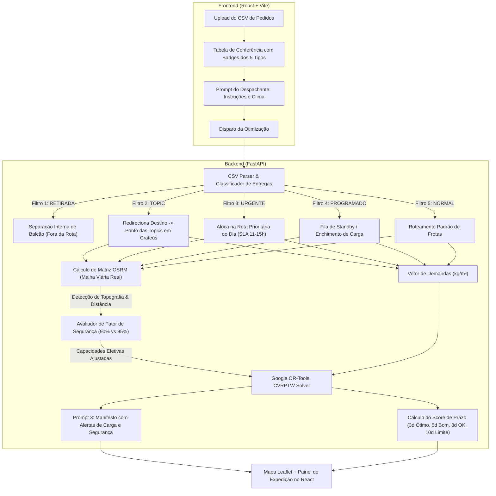

# 🗺️ Plano de Implementação: Otimização Dinâmica de Rotas via Upload de CSVs (Google OR-Tools & Engenharia de Prompt)

Este documento define a arquitetura e o plano de implementação do sistema de roteirização logística, calibrado com a **matriz oficial dos 5 tipos de entrega**, **política de SLAs (prazos para Crateús e Interiores)**, **análise de custo mínimo de frete** e a **regra de margem de segurança de carga (90% para serras/longas distâncias vs 95% para trajetos planos/urbanos)**, utilizando **FastAPI**, **Google OR-Tools** e **Engenharia de Prompt**.

---

## 1. 📦 Matriz Oficial dos 5 Tipos de Entrega

O sistema classifica e trata cada linha da planilha CSV enviada de acordo com as seguintes regras de negócio estritas:

| Tipo de Entrega | Descrição e Regra de Negócio | Destino Geográfico no Mapa | Tratamento no Google OR-Tools |
| :--- | :--- | :--- | :--- |
| **`RETIRADA`** | O próprio cliente retira na loja/balcão. **Não necessita de frete ou caminhão.** | Nenhum (excluído da rota de veículos). | **Filtrado no pré-processamento.** Não entra no grafo de roteirização. É enviado diretamente para a lista de separação do estoque da loja. |
| **`URGENTE`** | Atendimento prioritário no mesmo dia ou o mais rápido possível. Aplica-se a **clientes fiéis/recorrentes** ou **primeira compra com grande volume/valor**. | Endereço do cliente (Crateús ou Interior). | **Inclusão mandatória na 1ª rota** ou penalidade extrema de descarte (`penalidade = 1.000.000`). Se for Crateús, janela de tempo restrita (11h–15h). |
| **`NORMAL`** | Entrega padrão convencional. Agrupada nas rotas regulares semanais. | Endereço do cliente. | Otimização padrão de custo/distância com base nas capacidades efetivas de peso ($kg$) e volume ($m^3$). |
| **`TOPIC`** *(ou Topique / Carro Horário)* | Mercadoria despachada via transporte intermunicipal/vans de passageiros. **O caminhão não vai até o interior.** | **Ponto das Topics (Terminal Rodoviário de Crateús)**. | O destino é fixado nas coordenadas do **Ponto de Embarque das Topics em Crateús**, com janela de tempo rígida (horário de partida das vans, ex: até as 10:00h). |
| **`PROGRAMADO`** | Entrega sem data fixa imediata (**Standby**). Aguarda consolidação de carga para a região ou sinalização do cliente. | Endereço do cliente no interior. | **Nó opcional com disjunção.** Só entra na rota se houver sobra de espaço no caminhão e a rota passar perto da localidade sem desvio custoso. |

---

## 2. ⏱️ Prazos (SLAs), Custo Mínimo e Margem de Segurança de Carga

### A. Entregas Locais — Dentro da Cidade (Crateús Urbano)
- **Janela de Atendimento:** Máximo de **11 a 15 horas** (mesmo dia / intradiário).
- **Veículos Ideais:** `Motos` (até $300\text{ kg}$) para itens leves ou `HR Bongo` (até $1.700\text{ kg}$) para materiais médios.

### B. Entregas Fora da Cidade — Interiores e Municípios Vizinhos
*(Ipaporanga, Poranga, Ararendá, Novo Oriente, Independência, Tamboril, Nova Russas, Buriti dos Montes, etc.)*
- **Prazo Limite Absoluto:** **10 dias** (não pode ultrapassar sob hipótese alguma).
- **Escala de Avaliação de Eficiência (Score Logístico):**
  - ⭐⭐⭐ **Ótimo:** até **3 dias**
  - ⭐⭐ **Bom:** até **5 dias**
  - ⭐ **OK:** até **8 dias**
  - ⚠️ **Limite Máximo:** até **10 dias**

### C. Custo Mínimo e Viabilidade Econômica (Consolidação de Carga)
Para viagens rurais/interiores:
- Um caminhão pesado (**Accelo 815 - 4.800 kg**) só deve ser despachado para uma rota de interior se atingir uma **taxa de ocupação mínima** ($\ge 60\%$ da capacidade) OU se a soma do valor dos pedidos cobrir o custo de combustível do trecho.
- Pedidos com status **`PROGRAMADO`** são utilizados estrategicamente para completar essa ocupação mínima. Se o pedido mais antigo na região atingir $\ge 8$ dias, o despacho torna-se obrigatório para cumprir o SLA máximo de 10 dias.

### D. ⚠️ Regra de Segurança de Carga: 90% (Serras / Longa Distância) vs 95% (Plano / Urbano)
A capacidade máxima permitida na carroceria varia dinamicamente de acordo com o relevo e a distância do trajeto:

| Perfil do Trajeto | Cidades / Regiões de Exemplo | Teto de Carga Permitido | Justificativa Operacional de Segurança |
| :--- | :--- | :---: | :--- |
| **Serras, Trechos Rurais e Longas Distâncias** | *Buriti dos Montes (divisa PI), Poranga, Ipaporanga, Monte Nebo, Ibiapaba* | **Máximo de 90%** da capacidade do veículo | Prevenção contra tombamento, superaquecimento de freios em descidas íngremes de serra, esforço mecânico em estradas vicinais não pavimentadas. |
| **Rotas Urbanas, Planas e Proximidades** | *Crateús Urbano, distritos planos vizinhos e distâncias curtas* | **Até 95%** da capacidade do veículo | Asfalto regular, terreno plano, velocidade controlada e facilidade de suporte/resgate operacional imediato. |

#### Aplicação Numérica na Frota:

| Veículo | Capacidade Nominal | Capacidade Segura em Serra / Longa Distância (**90%**) | Capacidade em Área Urbana / Plana (**95%**) |
| :--- | :---: | :---: | :---: |
| **Accelo 815** | $4.800\text{ kg} \mid 2,45\text{ m}^3$ | **$4.320\text{ kg} \mid 2,20\text{ m}^3$** | **$4.560\text{ kg} \mid 2,33\text{ m}^3$** |
| **HR / Bongo** | $1.700\text{ kg} \mid 2,18\text{ m}^3$ | **$1.530\text{ kg} \mid 1,96\text{ m}^3$** | **$1.615\text{ kg} \mid 2,07\text{ m}^3$** |
| **Motos** | $300\text{ kg} \mid 0,38\text{ m}^3$ | *(Não se aplica a trechos longos de serra)* | **$285\text{ kg} \mid 0,36\text{ m}^3$** |

---

## 3. 🏛️ Arquitetura do Sistema Atualizada



---

## 4. 🧠 Engenharia de Prompt: Especificação dos Prompts de Negócio

### Prompt 1: Extrator Semântico de Restrições e Perfil de Rota
- **Técnica:** *Few-Shot Prompting* com detecção de relevo e distâncias.
- **Objetivo:** Ler as instruções do operador e classificar se a rota opera em regime de 90% (serra/distante) ou 95% (urbana/plana).

```markdown
Você é o Especialista em Logística da Distribuidora em Crateús-CE.
Configure os parâmetros para o solucionador Google OR-Tools considerando as regras da empresa:

### Regras de Negócio:
1. 5 Tipos de Entrega: RETIRADA (ignorar), URGENTE (mesmo dia / 11h-15h em Crateús), NORMAL (padrão), TOPIC (Ponto das Topics em Crateús), PROGRAMADO (standby).
2. Fator de Segurança de Carga:
   - Se o destino incluir cidades de serra ou interior distante (Buriti dos Montes, Poranga, Ipaporanga, Monte Nebo): teto de 90% da capacidade do veículo por segurança mecânica.
   - Se for entrega dentro de Crateús ou terreno plano próximo: permite até 95% da capacidade do veículo.

### Entrada Atual:
Instrução do Despachante: "{{ USER_DISPATCH_PROMPT }}"
Cidades presentes no Lote: {{ CITIES_IN_BATCH }}

Responda com o JSON estrito:
{
  "apply_pickup_filter": true,
  "route_topography_profile": "serra_distante" | "urbana_plana",
  "safety_capacity_factor": 0.90 | 0.95,
  "topic_hub_address": "Terminal Rodoviário de Crateús, CE",
  "crateus_sla_max_hours": 15,
  "interior_sla_days_target": 3,
  "effective_vehicle_limits": {
    "Accelo_815_kg": 4320,
    "HR_Bongo_kg": 1530
  },
  "safety_justification": "Explicar se aplicou 90% devido à serra/estrada vicinal ou 95% para trecho urbano plano."
}
```

---

### Prompt 2: Analista de Viabilidade Econômica e Custo Mínimo
- **Técnica:** *Chain-of-Thought Econômico*.
- **Objetivo:** Avaliar o ponto de equilíbrio e justificar a saída do caminhão respeitando o teto de 90% em serras.

```markdown
Você é o Gestor de Custos de Frota.
Analise a rota proposta para o interior:
- Destino / Polo: {{ DESTINATION_CLUSTER }} (Perfil: {{ PROFILE_SERRA_OU_PLANO }})
- Capacidade Nominal do Veículo: {{ TRUCK_CAPACITY_NOMINAL }} kg
- Teto de Segurança Aplicável: {{ SAFETY_FACTOR_PERCENT }}% (Capacidade Efetiva Máxima: {{ EFFECTIVE_MAX_KG }} kg)
- Carga Alocada atual: {{ LOAD_KG }} kg ({{ EFFECTIVE_LOAD_PERCENT }}% do teto seguro)
- Dias de espera do pedido mais antigo: {{ MAX_DAYS_WAITING }} dias

Critérios de Decisão:
1. Se MAX_DAYS_WAITING >= 8 dias: AUTORIZAR DESPACHO IMEDIATO (evita estourar o SLA de 10 dias).
2. Se LOAD_KG ultrapassar {{ EFFECTIVE_MAX_KG }} kg: BLOQUEAR DESPACHO (risco de segurança em serra).
3. Se LOAD_PERCENT >= 60% e dentro do teto seguro: AUTORIZAR DESPACHO.
4. Se LOAD_PERCENT < 60% e dias <= 5: RETER pedidos PROGRAMADO para consolidar mais carga.

Emita a decisão: "AUTORIZAR_DESPACHO" ou "CONSOLIDAR_MAIS_PEDIDOS" com a justificativa de segurança e custo.
```

---

### Prompt 3: Manifesto Operacional para Motoristas e Expedição
- **Técnica:** *Executive Operational Manifest*.
- **Objetivo:** Manifesto completo com avisos explícitos sobre limite de 90% em serra e horários do Ponto das Topics.

```markdown
Você é o Chefe de Expedição do Centro de Distribuição em Crateús-CE.
Gere o Manifesto de Carga para o veículo {{ VEHICLE_NAME }} contendo:
1. 🚚 Identificação do Veículo e Medidor de Segurança de Carga:
   - Carga Total Transportada vs Teto Seguro (ex: *4.150 kg de 4.320 kg - 96% do limite seguro de 90%*).
   - Aviso de rota: *"Trajeto com trechos de serra em {{ CIDADES_SERRA }}: carga mantida rigorosamente abaixo de 90% por segurança"*.
2. 🚐 Paradas no Ponto das Topics de Crateús (com horário limite da van).
3. 🔴 Alertas de Pedidos URGENTES (destacando clientes VIP ou primeiras compras volumosas).
4. 📦 Ordem de Carregamento na Carroceria (LIFO: primeira entrega na porta do baú).
5. 📊 Score de Prazo do Interior: Classificar se as entregas estão na faixa ÓTIMA (até 3d), BOA (até 5d), OK (até 8d) ou no LIMITE (até 10d).

Formate em Markdown executivo e limpo para compartilhamento no WhatsApp do motorista.
```

---

## 5. ⚙️ Implementação no Google OR-Tools com Limites Dinâmicos

No arquivo `backend/app/services/route_optimizer.py`:

```python
from ortools.constraint_solver import routing_enums_pb2, pywrapcp
from typing import Dict, List, Any

# Cidades com relevo acidentado / serras / estradas vicinais distantes
MOUNTAIN_OR_REMOTE_CITIES = {
    "BURITI DOS MONTES", "PORANGA", "IPAPORANGA", "MONTE NEBO", "IBIAPABA"
}

def calculate_effective_capacity(nominal_kg: int, destination_cities: List[str]) -> int:
    """
    Aplica o teto de 90% para serras/longas distâncias e 95% para trechos planos/urbanos.
    """
    has_mountain_or_remote = any(
        city.strip().upper() in MOUNTAIN_OR_REMOTE_CITIES 
        for city in destination_cities
    )
    factor = 0.90 if has_mountain_or_remote else 0.95
    return int(nominal_kg * factor)

def solve_dynamic_cvrp(
    distance_matrix: List[List[int]],
    weights_kg: List[int],
    vehicle_nominal_capacities_kg: List[int],
    destination_cities: List[str],
    urgency_penalties: List[int],
    num_vehicles: int = 1,
    depot_index: int = 0,
) -> Dict[str, Any]:
    
    # 1. Calcula a capacidade efetiva dinâmica com o fator de segurança
    effective_capacities = [
        calculate_effective_capacity(nom_cap, destination_cities)
        for nom_cap in vehicle_nominal_capacities_kg
    ]

    manager = pywrapcp.RoutingIndexManager(len(distance_matrix), num_vehicles, depot_index)
    routing = pywrapcp.RoutingModel(manager)

    # 2. Distância
    def distance_callback(from_idx, to_idx):
        return distance_matrix[manager.IndexToNode(from_idx)][manager.IndexToNode(to_idx)]
    
    transit_idx = routing.RegisterTransitCallback(distance_callback)
    routing.SetArcCostEvaluatorOfAllVehicles(transit_idx)

    # 3. Dimensão de Peso com Capacidade Efetiva Segura (90% ou 95%)
    def weight_callback(from_idx):
        return weights_kg[manager.IndexToNode(from_idx)]

    weight_idx = routing.RegisterUnaryTransitCallback(weight_callback)
    routing.AddDimensionWithVehicleCapacity(
        weight_idx, 0, effective_capacities, True, "Capacity_Weight_KG"
    )

    # 4. Disjunções com Penalidades (URGENTE = 1.000.000, PROGRAMADO = 10.000)
    for node in range(1, len(distance_matrix)):
        routing.AddDisjunction([manager.NodeToIndex(node)], urgency_penalties[node])

    # 5. Parâmetros de Busca (Guided Local Search)
    search_params = pywrapcp.DefaultRoutingSearchParameters()
    search_params.first_solution_strategy = routing_enums_pb2.FirstSolutionStrategy.PATH_CHEAPEST_ARC
    search_params.local_search_metaheuristic = routing_enums_pb2.LocalSearchMetaheuristic.GUIDED_LOCAL_SEARCH
    search_params.time_limit.seconds = 5

    solution = routing.SolveWithParameters(search_params)
    if not solution:
        return {"success": False, "message": "Nenhuma rota viável dentro dos limites de segurança"}

    # Extrai o plano com detalhamento da margem de segurança aplicada
    routes = []
    for v_id in range(num_vehicles):
        index = routing.Start(v_id)
        stops = []
        total_dist = 0
        total_weight = 0

        while not routing.IsEnd(index):
            node = manager.IndexToNode(index)
            total_weight += weights_kg[node]
            prev = index
            index = solution.Value(routing.NextVar(index))
            total_dist += routing.GetArcCostForVehicle(prev, index, v_id)
            stops.append({"node": node, "cumulative_kg": total_weight})

        stops.append({"node": manager.IndexToNode(index), "cumulative_kg": total_weight})
        routes.append({
            "vehicle_id": v_id,
            "stops": stops,
            "total_distance_km": round(total_dist / 1000, 2),
            "total_weight_kg": total_weight,
            "effective_capacity_limit_kg": effective_capacities[v_id],
            "nominal_capacity_kg": vehicle_nominal_capacities_kg[v_id],
            "applied_safety_factor": "90% (Serra / Longa Distância)" if effective_capacities[v_id] < vehicle_nominal_capacities_kg[v_id] * 0.93 else "95% (Urbano / Plano)",
            "safety_compliance": total_weight <= effective_capacities[v_id]
        })

    return {"success": True, "routes": routes}
```

---

## 6. 💻 Interface no Frontend (React + Leaflet)

1. **Card de Monitoramento da Capacidade Segura:**
   - Barra de progresso com marcador do teto:
     - Se o trajeto contiver serra: teto em **90%** com aviso em amarelo: ⚠️ *Trajeto com serra/ladeiras: carga limitada a 90% por segurança mecânica*.
     - Se for plano/urbano: teto em **95%** com aviso em verde: 🟢 *Trajeto urbano/plano: operando em até 95% da capacidade*.
2. **Badges dos 5 Tipos:**
   - 🔘 `RETIRADA`, 🔴 `URGENTE`, 🔵 `NORMAL`, 🟠 `TOPIC`, 🟣 `PROGRAMADO`.
3. **Indicador de SLA do Interior:**
   - Score das entregas: 🟢 Ótimo ($\le 3$ dias), 🟡 Bom ($\le 5$ dias), 🟠 OK ($\le 8$ dias), 🔴 Limite ($\le 10$ dias).
4. **Ponto das Topics:**
   - Marcador em Crateús destacando o horário de embarque na van.

---

## 7. 📅 Roteiro de Entrega Final

- **Fase 1:** Parser agnóstico de CSV com classificador dos 5 tipos e filtro de `RETIRADA`.
- **Fase 2:** Módulo dinâmico de segurança de carga ($90\%$ serra vs $95\%$ urbano) e cálculo de SLA ($11\text{-}15\text{h}$ Crateús vs $3/5/8/10$ dias interior).
- **Fase 3:** Solver Google OR-Tools com capacidades dinâmicas e paradas no Ponto das Topics.
- **Fase 4:** Prompts LLM especializados (Parser semântico, viabilidade econômica e manifesto LIFO).
- **Fase 5:** Interface React interativa com mapa Leaflet, medidores de segurança e download de manifesto.
