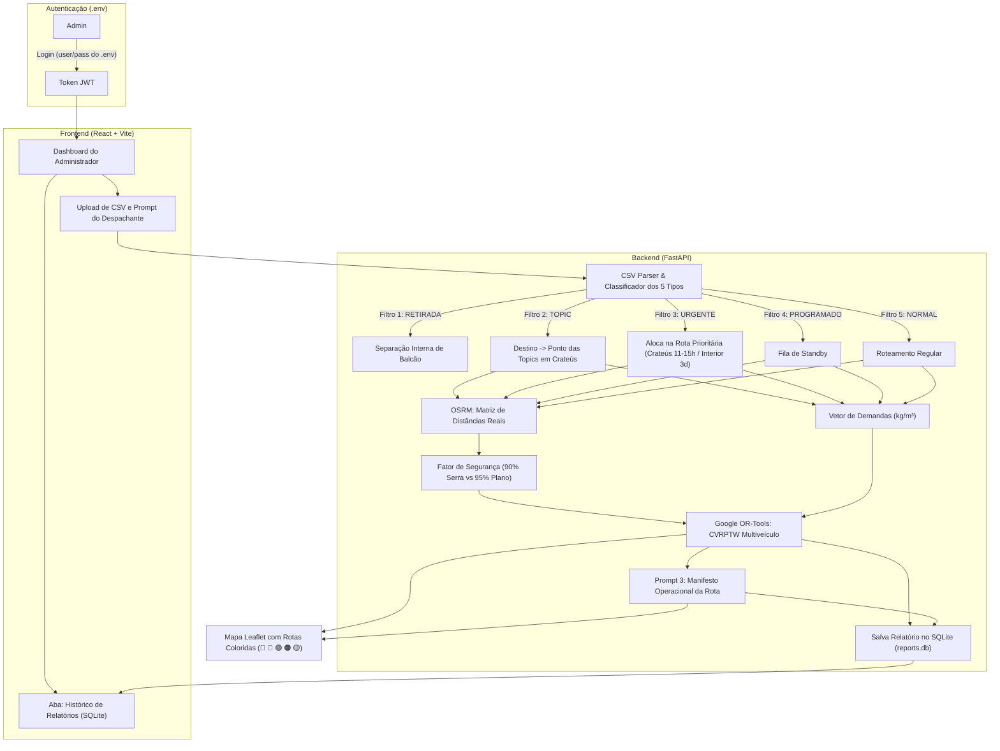

# 🗺️ Plano de Implementação: Otimização Dinâmica de Rotas via Upload de CSVs (Google OR-Tools & Engenharia de Prompt)

Este documento define a arquitetura e o plano de implementação do sistema de roteirização logística, calibrado com:
- **Autenticação Administrativa Segura:** Login único de Admin com credenciais hardcoded via `.env`.
- **Persistência de Relatórios em SQLite:** Armazenamento do histórico de manifestos, métricas e trajetos calculados em banco local.
- **Matriz Oficial dos 5 Tipos de Entrega:** Incluindo regra de **`URGENTE` para fora da cidade com SLA acelerado de até 3 dias** (vs 11–15h em Crateús).
- **Frota Oficial Colorida com Emojis:** 🔵 Accelo Médio 1, 🔴 Accelo Médio 2, 🟢 Kia Pequeno, 🟠 HR Pequeno e 🟡 **Moto Titan 160 Start ($300\text{ kg} \mid 0,3833\text{ m}^3$)**.
- **Regra de Segurança de Carga:** 90% para trechos de serra e longas distâncias vs 95% para trajetos planos e urbanos.

---

## 1. 🔐 Autenticação Administrativa (Admin via `.env`)

O acesso ao sistema será restrito ao administrador/operador logístico da empresa, sem necessidade de banco de usuários complexo:

### A. Configuração no `.env` do Backend:
```env
# Credenciais do Administrador
ADMIN_USERNAME=admin
ADMIN_PASSWORD=hackathon_admin_2026
JWT_SECRET_KEY=chave_secreta_super_segura_hackathon_2026_jwt
ACCESS_TOKEN_EXPIRE_MINUTES=1440
```

### B. Fluxo de Autenticação (`backend/app/api/v1/endpoints/auth.py`):
1. **Endpoint `POST /api/v1/auth/login`**:
   - Recebe `username` e `password`.
   - Compara diretamente com as variáveis `ADMIN_USERNAME` e `ADMIN_PASSWORD` definidas no `.env`.
   - Se válidas, gera um token JWT de sessão (ou Bearer Token).
   - Se inválidas, retorna `401 Unauthorized` (*"Usuário ou senha incorretos"*).
2. **Endpoint `GET /api/v1/auth/me`**:
   - Valida o token e confirma se a sessão está ativa.
3. **Frontend (React + Vite)**:
   - Tela de Login inicial limpa e responsiva.
   - Contexto de Autenticação (`AuthContext.tsx`) armazenando o token no `localStorage`.
   - Bloqueio de rotas: o usuário só acessa o upload de CSV, mapa e relatórios após login.

---

## 2. 🗄️ Persistência de Relatórios em Banco de Dados SQLite

Cada otimização de rota gerada gera um registro completo salvo automaticamente em um banco local **SQLite** (`backend/data/reports.db`), permitindo consulta de histórico, auditoria e reabertura de rotas no mapa:

### A. Estrutura da Tabela `reports` (SQLite):
```sql
CREATE TABLE IF NOT EXISTS reports (
    id INTEGER PRIMARY KEY AUTOINCREMENT,
    created_at TIMESTAMP DEFAULT CURRENT_TIMESTAMP,
    filename TEXT NOT NULL,
    user_prompt TEXT,
    total_orders INTEGER NOT NULL,
    total_weight_kg REAL NOT NULL,
    total_distance_km REAL NOT NULL,
    manifest_markdown TEXT NOT NULL,
    routes_json TEXT NOT NULL,
    vehicles_used TEXT NOT NULL
);
```

### B. Endpoints de Relatórios (`backend/app/api/v1/endpoints/reports.py`):
| Método | Rota | Descrição |
| :--- | :--- | :--- |
| `GET` | `/api/v1/reports` | Lista o histórico com data, arquivo, quantidade de pedidos, km total e veículos usados. |
| `GET` | `/api/v1/reports/{id}` | Recupera o relatório completo com o manifesto Markdown e GeoJSON para renderizar no Leaflet. |
| `DELETE` | `/api/v1/reports/{id}` | Exclui um relatório do histórico. |

---

## 3. 📦 Matriz Oficial dos 5 Tipos de Entrega & Políticas de SLA

| Tipo de Entrega | Regra de Negócio & SLA | Destino Geográfico | Tratamento no Google OR-Tools |
| :--- | :--- | :--- | :--- |
| **`RETIRADA`** | O próprio cliente retira na loja/balcão. **Não necessita de frete ou caminhão.** | Nenhum (fora da rota). | **Filtrado no pré-processamento.** Não entra no grafo de veículos. Enviado diretamente para a lista de separação interna da loja. |
| **`URGENTE`** | Atendimento prioritário para **clientes fiéis VIP** ou **primeira compra de grande valor**. **É o tipo de pedido utilizado para completar a carga no custo mínimo da rota**: <br>• **Dentro de Crateús:** Entrega no mesmo dia em **11 a 15 horas**.<br>• **Fora da Cidade (Interior):** Prazo acelerado em **até 3 dias** (ao invés do normal que vai até 10 dias). | Endereço do cliente (Crateús ou Interior). | **Inclusão prioritária obrigatória e gatilho para completar carga.** Puxado estrategicamente para preencher a capacidade do veículo e viabilizar o custo do frete. Penalidade extrema de descarte (`penalidade = 1.000.000`). |
| **`NORMAL`** | Entrega padrão convencional. Segue o agrupamento semanal regular. | Endereço do cliente. | Roteamento por menor custo/distância com base nas capacidades efetivas de peso ($kg$) e volume ($m^3$). |
| **`TOPIC`** *(ou Topique / Carro Horário)* | Mercadoria despachada via vans intermunicipais. **O caminhão da empresa não viaja até o interior.** | **Ponto das Topics (Terminal de Crateús)**. | O destino é fixado nas coordenadas do **Terminal das Topics em Crateús**, com janela de tempo matutina (horário de saída das vans, ex: até as 10:00h). |
| **`PROGRAMADO`** | Entrega sem data fixa imediata (**Standby**). Aguarda consolidação de carga ou sinalização do cliente (seja na cidade ou no interior). | Endereço do cliente (**dentro da cidade em Crateús OU no interior**). | **Nó opcional com disjunção.** Só entra na rota se houver sobra de espaço no veículo (urbano ou de interior) e a rota passar perto da localidade sem desvio custoso. |

---

## 4. ⏱️ Prazos (SLAs), Custo Mínimo e Margens de Carga

### A. Tabela Geral de Prazos (SLAs):
- **Crateús (Urbano):**
  - `URGENTE` / `NORMAL`: Máximo de **11 a 15 horas** (mesmo dia / intradiário).
- **Interiores e Cidades Vizinhas (Ipaporanga, Poranga, Ararendá, Buriti dos Montes, etc.):**
  - `URGENTE`: **Até 3 dias** (SLA Acelerado Obrigatório).
  - `NORMAL`: Escala de eficiência logística:
    - ⭐⭐⭐ **Ótimo:** até **3 dias**
    - ⭐⭐ **Bom:** até **5 dias**
    - ⭐ **OK:** até **8 dias**
    - ⚠️ **Limite Máximo:** até **10 dias**

### B. Custo Mínimo e Viabilidade Econômica (Consolidação de Carga):
- Caminhões médios (**Accelo Médio 1 e 2**) só devem partir para o interior se atingirem **taxa de ocupação mínima** ($\ge 60\%$ da capacidade) OU se o valor dos pedidos cobrir o combustível.
- **Papel do Pedido URGENTE no Custo Mínimo:** São os pedidos com status **`URGENTE`** que são utilizados estrategicamente para **completar a carga** do caminhão! A presença de pedidos urgentes atua como o gatilho econômico e operacional que viabiliza a saída do veículo para a rota, preenchendo a capacidade ociosa com prioridade de despacho.
- Se o pedido normal mais antigo na região atingir $\ge 8$ dias, o despacho torna-se obrigatório para não estourar o limite de 10 dias de SLA.

### C. ⚠️ Regra de Segurança de Carga: 90% (Serra / Longa Distância) vs 95% (Plano / Urbano):
- **Serras, Trechos Rurais e Longas Distâncias:** *Buriti dos Montes, Poranga, Ipaporanga, Monte Nebo, Ibiapaba* $\rightarrow$ **Máximo de 90%** da capacidade do veículo por segurança mecânica, frenagem e subidas acidentadas.
- **Rotas Urbanas, Planas e Proximidades:** *Crateús Urbano e distritos planos vizinhos* $\rightarrow$ **Até 95%** da capacidade do veículo.

### D. 📦 Ordem de Carregamento Físico no Caminhão (Precedência da Rota Total)
A montagem da carga no baú/carroceria do veículo segue uma regra física estrita após a rota ser calculada pelo Google OR-Tools:
1. **Cálculo Prévio da Rota Total:** Primeiro o sistema calcula a rota completa do início ao fim (Parada 1 $\rightarrow$ Parada 2 $\rightarrow$ ... $\rightarrow$ Parada $N$).
2. **Posicionamento por Precedência Reversa:**
   - **1º a ser colocado no caminhão (Fundo do Baú):** A entrega **mais distante** (última parada da rota: Parada $N$).
   - **Posições intermediárias (Meio do Baú):** As entregas intermediárias em ordem decrescente ($N-1$, $N-2$, ...).
   - **Último a ser colocado no caminhão (Porta / Saída do Baú):** A entrega **mais próxima** (primeira parada da rota: Parada 1).
3. **Benefício Operacional:** O motorista descarrega diretamente na porta sem necessidade de remanejamento de cargas pesadas durante o trajeto.

### E. 🏙️ Roteamento Inteligente: Entre-Localidades vs. Rota Detalhada Intra-Urbana
O motor de roteirização aplica tratamento diferenciado conforme a granularidade geográfica dos dados no CSV:
1. **Se no CSV constar SÓ A CIDADE (ex: `CRATEUS`, `IPAPORANGA`, `SANTANA`):**
   - Agrupa os pedidos no **polo central da localidade** (`is_intra_city = False`, `route_type = 'POLO_LOCALIDADE'`).
   - A distância entre paradas no mesmo polo urbano é fixada em **$0\text{ m}$**, sem criar percursos fictícios pelas ruas.
   - O cálculo de menor distância do Google OR-Tools otimiza estritamente o deslocamento **entre localidades** (rodoviário de polo a polo).
2. **Se no CSV constar ENDEREÇO OU BAIRRO DENTRO DA CIDADE (ex: `CRATEUS - SAO VICENTE`, `VENANCIOS`, `RUA CEL ZEZE`):**
   - Geocodifica o ponto na malha viária urbana da cidade (`is_intra_city = True`, `route_type = 'URBANO_DETALHADO'`).
   - A matriz de distâncias considera a malha de quarteirões urbanos (fator Manhattan $1,414$ e velocidade média urbana de $25\text{ km/h}$, ou OSRM).
   - O Google OR-Tools calcula a **melhor rota DENTRO da cidade** (rua a rua / bairro a bairro), sequenciando as entregas sem ziguezague, **além de otimizar a conexão rodoviária entre as cidades**.

### F. 🎯 As 5 Opções Estratégicas de Rota (Google OR-Tools)
O sistema calcula simultaneamente 5 variações para apoiar a decisão operacional do gestor:
- **`recomendada` (Melhor Rota / Equilibrada):** Ponto de equilíbrio multiobjetivo entre menores distâncias, janelas prioritárias de SLA e limites seguros de carga.
- **`menor_custo` (Mais Econômica):** Foco na minimização do custo financeiro total em R$ (soma do combustível consumido e custo por km rodado).
- **`menor_tempo` (Mais Rápida):** Foco na agilidade máxima e menor tempo total em trânsito com equilíbrio de jornada de motoristas.
- **`menor_peso` (Carga Leve):** Distribuição suave de peso entre os veículos para menor desgaste mecânico em aclives e serras.
- **`menor_volume` (Mais Compacta):** Foco no melhor adensamento volumétrico ($m^3$) e ocupação de espaço do baú.

### G. ⚡ Arquitetura em 2 Etapas: Otimização Leve vs. Detalhamento Sob Demanda
1. **Etapa 1 — `POST /api/v1/routing/optimize` (Sem campo `strategy`):**
   - O operador envia o CSV sem precisar selecionar previamente uma estratégia.
   - O OR-Tools processa as 5 estratégias em lote e persiste os cálculos completos na tabela `reports` (`reports.db`).
   - Retorna um **payload JSON leve** (~90% menor) contendo `report_id` e o array `strategies_summary` com os 5 cards executivos de decisão (distância km, tempo h, combustível L, custo R$, veículos e paradas).
2. **Etapa 2 — `GET /api/v1/routing/summary/{report_id}?strategy={strategy_id}` (Consumo Instantâneo):**
   - Ao clicar na estratégia escolhida, o frontend consome este endpoint.
   - O backend **não roda o OR-Tools novamente**: recupera instantaneamente os dados já processados no SQLite (< 10ms).
   - Retorna os dados consolidados prontos para o frontend renderizar/gerar o PDF, traçar o GeoJSON no Leaflet e orientar a ordem física de carregamento LIFO no baú.

### H. ⛽ Métrica de Combustível e Autonomia por Veículo
Para cada veículo com entregas alocadas, o sistema calcula:
- Consumo estimado em litros e custo em R$ considerando **ida e retorno ao CD Crateús**.
- Avaliação de autonomia em relação ao tanque cheio:
  - `SUFICIENTE`: Consumo < 80% do tanque.
  - `ALERTA_RESERVA`: Consumo entre 80% e 100% do tanque.
  - `NECESSITA_ABASTECIMENTO`: Consumo > 100% do tanque (exige parada em posto).

### I. 🚚 Recomendação Inteligente do Melhor Caminhão para a Rota (`recommended_truck`)
Para auxiliar a decisão do operador, o backend analisa as características agregadas do lote de pedidos a despachar e recomenda proativamente o melhor caminhão:
- **Lógica de Seleção:**
  - Se for lote estritamente urbano em Crateús até $285\text{ kg} \mid 0,36\text{ m}^3$: recomenda **Moto Titan 160 Start (`CRA-5E05`)**.
  - Se a carga for intermediária (até $1.530\text{ kg}$ em serra ou $1.615\text{ kg}$ no plano): recomenda os utilitários pequenos **Kia Pequeno (`CRA-3C03`)** ou **HR Pequeno (`CRA-4D04`)**, economizando combustível frente a caminhões médios.
  - Se a carga for pesada (até $4.320\text{ kg}$ em serra ou $4.560\text{ kg}$ no plano): recomenda os caminhões médios **Accelo Médio 1 (`CRA-1A01`)** ou **Accelo Médio 2 (`CRA-2B02`)**.
- **Retorno no JSON:** Objeto `recommended_truck` presente tanto no payload de `POST /api/v1/routing/optimize` quanto em `GET /api/v1/routing/summary/{report_id}`, incluindo justificativa técnica textual (`reason`) e taxa de ocupação prevista.

### J. 📅 Filtragem de Pedidos por Intervalo de Datas (`start_date` e `end_date`)
Permite ao despachante enviar planilhas consolidadas mensais e restringir a análise e a rota apenas aos pedidos de um período determinado (ex: pedidos da semana corrente):
- Parâmetros opcionais `start_date` e `end_date` nos endpoints `/preview` e `/optimize` (formatos aceitos: `DD/MM/YYYY` ou `YYYY-MM-DD`).
- Pedidos com data fora da faixa são excluídos do grafo de roteamento e da pesagem de carga.
- Resposta documenta os metadados em `date_filter_applied` (`total_orders_before_filter`, `orders_retained`, `orders_filtered_out`, `applied`).

---

## 5. 🚛 Frota Oficial da Empresa: Veículos, Cores, Emojis, Placas e Capacidades

A frota oficial conta com **5 veículos**, cada um com nome, placa de simulação, cor e emoji para visualização inequívoca no pátio, nas rotas do mapa e relatórios:

| Emoji | Cor | Código Hex | Placa Simulada | Nome Oficial do Veículo | Perfil de Operação | Capacidade Nominal | Limite Serra (**90%**) | Limite Urbano (**95%**) |
| :---: | :---: | :---: | :---: | :--- | :--- | :---: | :---: | :---: |
| 🔵 | **Azul** | `#2563EB` | `CRA-1A01` | **Accelo Médio 1** | Médio / Rotas de Interior (Eixo Oeste/Sul) | $4.800\text{ kg} \mid 2,45\text{ m}^3$ | **$4.320\text{ kg} \mid 2,20\text{ m}^3$** | **$4.560\text{ kg} \mid 2,33\text{ m}^3$** |
| 🔴 | **Vermelho** | `#DC2626` | `CRA-2B02` | **Accelo Médio 2** | Médio / Rotas de Interior (Eixo Leste/Serra) | $4.800\text{ kg} \mid 2,45\text{ m}^3$ | **$4.320\text{ kg} \mid 2,20\text{ m}^3$** | **$4.560\text{ kg} \mid 2,33\text{ m}^3$** |
| 🟢 | **Verde** | `#16A34A` | `CRA-3C03` | **Kia Pequeno** | Médio / Cargas Intermediárias e Interior Próximo | $1.700\text{ kg} \mid 2,18\text{ m}^3$ | **$1.530\text{ kg} \mid 1,96\text{ m}^3$** | **$1.615\text{ kg} \mid 2,07\text{ m}^3$** |
| 🟠 | **Laranja** | `#EA580C` | `CRA-4D04` | **HR Pequeno** | Médio / Urgências e Cargas Médias Urbanas | $1.700\text{ kg} \mid 2,18\text{ m}^3$ | **$1.530\text{ kg} \mid 1,96\text{ m}^3$** | **$1.615\text{ kg} \mid 2,07\text{ m}^3$** |
| 🟡 | **Amarelo** | `#EAB308` | `CRA-5E05` | **Moto Titan 160 Start** | Expresso / Ponto das Topics & Urgências Urbanas (Titan 160 Start) | **$300\text{ kg} \mid 0,3833\text{ m}^3$** | *(Não vai para serra)* | **$285\text{ kg} \mid 0,3641\text{ m}^3$** |

---

## 6. 🏛️ Arquitetura do Sistema Atualizada



---

## 7. 🧠 Engenharia de Prompt Atualizada

### Prompt 1: Extrator Semântico de Restrições e SLA de Urgência
```markdown
Você é o Especialista em Logística da Distribuidora em Crateús-CE.
Configure os parâmetros para o solucionador Google OR-Tools considerando:

1. Frota Disponível:
   - 🔵 Azul: Accelo Médio 1 (4.800 kg)
   - 🔴 Vermelho: Accelo Médio 2 (4.800 kg)
   - 🟢 Verde: Kia Pequeno (1.700 kg)
   - 🟠 Laranja: HR Pequeno (1.700 kg)
   - 🟡 Amarelo: Moto Titan 160 Start (300 kg | 0.3833 m³)
2. Regras de SLA de Urgência:
   - URGENTE dentro de Crateús: prioridade no mesmo dia (11h-15h).
   - URGENTE para o interior: deve ser entregue em até 3 dias (prazo acelerado prioritário).
3. Fator de Segurança:
   - 90% para destinos de serra/longa distância (Buriti dos Montes, Poranga, Ipaporanga, Monte Nebo).
   - 95% para trajetos urbanos ou planos.

Entrada: "{{ USER_DISPATCH_PROMPT }}"
Cidades: {{ CITIES_IN_BATCH }}

Gere o JSON estrito com os veículos ativados e parâmetros do solver.
```

---

### Prompt 3: Manifesto Operacional com Cores e Alerta de SLA
```markdown
Você é o Chefe de Expedição do Centro de Distribuição em Crateús-CE.
Gere o Manifesto de Carga da frota para os veículos ativados (🔵 Accelo 1, 🔴 Accelo 2, 🟢 Kia, 🟠 HR, 🟡 Moto).

O documento DEVE conter:
1. 🚚 Identificação do Veículo: Emoji, Cor e Nome Oficial.
2. ⚖️ Medidor de Segurança de Carga: Percentual ocupado vs teto seguro (90% serra ou 95% plano). Para Moto: limite máximo de 300 kg.
3. 🚐 Paradas no Ponto das Topics de Crateús (com horário limite da van).
4. 🔴 Alertas de Pedidos URGENTES:
   - Crateús: entrega prevista em até 11-15 horas.
   - Interior: entrega urgente em até 3 dias.
5. 📦 Ordem de Carregamento na Carroceria (LIFO: primeira entrega na porta do baú).
6. 📊 Score de Prazo do Interior: Classificar entregas normais em ÓTIMA (até 3d), BOA (até 5d), OK (até 8d) ou LIMITE (até 10d).

Formate em Markdown executivo para compartilhamento no WhatsApp e arquivo no SQLite.
```

---

## 8. 💻 Interface no Frontend (React + Leaflet + Histórico)

1. **Tela de Login do Administrador:**
   - Formulário de acesso rápido (usuário e senha do `.env`).
2. **Dashboard de Otimização:**
   - Upload de CSV com prévia e tabela de conferência dos 5 tipos.
   - Botão para disparar o cálculo com barra de progresso.
   - Mapa Leaflet com traçados nas cores oficiais: 🔵 Azul, 🔴 Vermelho, 🟢 Verde, 🟠 Laranja e 🟡 Amarelo.
3. **Aba "Histórico de Relatórios" (SQLite):**
   - Tabela com todos os despachos calculados salvos no banco.
   - Botão `[Visualizar Rota no Mapa]` (recarrega os GeoJSONs antigos no mapa).
   - Botão `[Ver Manifesto Markdown]` e `[Baixar CSV da Rota]`.

---

## 9. 📅 Roteiro de Entrega Final Atualizado

- **Fase 1:** Configuração da autenticação Admin via `.env` (JWT) e criação do banco SQLite para relatórios.
- **Fase 2:** Parser de CSV com classificação dos 5 tipos (`RETIRADA`, `URGENTE`, `NORMAL`, `TOPIC`, `PROGRAMADO`) e regras de SLA (11-15h Crateús vs 3d urgente interior).
- **Fase 3:** Solver Google OR-Tools com a frota oficial: Accelo Médio 1 (🔵), Accelo Médio 2 (🔴), Kia Pequeno (🟢), HR Pequeno (🟠) e Moto Titan 160 Start 300 kg (🟡), com limites de 90% em serras e 95% no plano.
- **Fase 4:** Prompts LLM e persistência automática dos relatórios calculados no SQLite.
- **Fase 5:** Interface React interativa com tela de login, mapa Leaflet colorido e tela de histórico de relatórios salvos.
